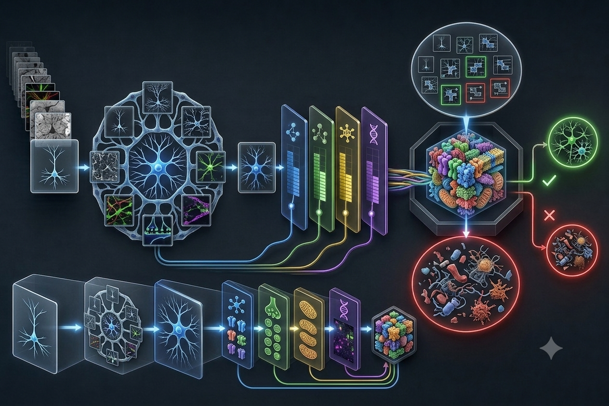

# Plexus



**A symmetry-routed exact classifier — a router, not a network.**

Plexus has no weights, no gates, no thresholds, no statistics. It resolves a binary grid to a
label by *pure structural routing*: a symmetry verdict (the shape's stabilizer under the dihedral
group D4) refined by an injected chain of D4-invariant coordinates, addressing one **context** that
owns its answer (majority label, with the irreducible contradictions — the *twins* — left to an exact
exception store). Resolution is exact and discrete; the only memory is the exception set.

The unifying idea is the **slice**: fix some coordinates of the descriptor and read what stays
constant / enumerate what varies. Classification runs the descriptor forward; generation runs it
backward (enumerate a context's fiber). The same move, read two ways.

## Quickstart

Requires **Java 21+** (records, sealed interfaces). No dependencies — the JDK is the whole toolchain.

```sh
# compile (macOS/Linux)
javac -d out $(find src -name "*.java")
# compile (Windows PowerShell)
javac -d out (Get-ChildItem -Recurse src -Filter *.java).FullName

# train + drop into the REPL
java -cp out org.tervel.plexus.Main data/conservation-t-orbit-3x3.txt
```

The REPL menu is a 2-D grid — classify/generate (rows) by node/whole-table (columns):

```
                 a node                                   the whole table
  resolve  ->  [1] stabilizer  [4] grid                   [5] score
  generate <-  [2] invariant   [3] label  [9] atoms  [s] scale  [p] prime   [6] topology  [7] possibility  [v] volume  [8] diagnose
  [q] quit
```

## Sixty seconds of output

**Automated invariant discovery.** Feed it a dataset where a path and a fork collide on every
routing coordinate (`data/separable-path-fork-5x5.txt`), press `[8]`, and the collision diagnostic
proves the collision is reducible and emits the formal spec of the missing invariant:

```
context [identity] sig=209
  collision: 1 positive / 1 negative (entropy 1.000 bits)
  verdict: SEPARABLE — colliding labels live in disjoint orbits.
  winning primitive: max-degree  (information gain 1.000 / 1.000 bits, EXACT split)
  blueprint (formal specification for the next Invariant):
    Δ(G) = max_{v∈V} deg(v) ... Separates branched cores (Δ≥3, e.g. the T's fork) from paths/cycles (Δ≤2).
  fiber breadth: 584 structures route here; primitive spreads them over 2 distinct values.
```

On the twin dataset (`data/twin-t-flip-3x3.txt`) the same press answers **PROVABLE SYMMETRY-TWIN** —
no invariant can ever separate orbit-mates, so the contradiction is memorised exactly, not modelled.

**The thread is the determinant.** Press `[v]` on the T-orbit dataset and the fiber volume is
measured five independent ways, with the orbit-stabilizer theorem checked as an exact identity:

```
  key                       |fiber| |orbit|  [G:Stab]  sqrt detJJ'  #span-tree  id
  ------------------------------------------------------------------------------------
  identity, mirrorH sig=55        8       4         4         8.25           1  ok
```

Run the two-scale renormalization experiment (does a structural law survive coarse-graining?):

```sh
java -cp out org.tervel.plexus.RenormalizationLoopRunner
```

## Where to read more

- **[PLEXUS_DESIGN.md](PLEXUS_DESIGN.md)** — the full design: the symmetry core, the invariant chain,
  the residual boundary, the two inverse operations, decomposition, and the "frames as physics" reading
  (treating the machine's structure as a coherence argument for analyzing the world).
- **[data/README.md](data/README.md)** — the datasets, each posing one slice-question (conservation,
  twin, position, separable, entropy, renormalization) and how to ask it from the menu.
- **[Plexus: Intuitions from a Symmetry Machine](https://noxidog.substack.com/p/plexus)** — the
  companion essay series, including a prompt that has your AI client explain Plexus through the
  lens of your own occupation.
